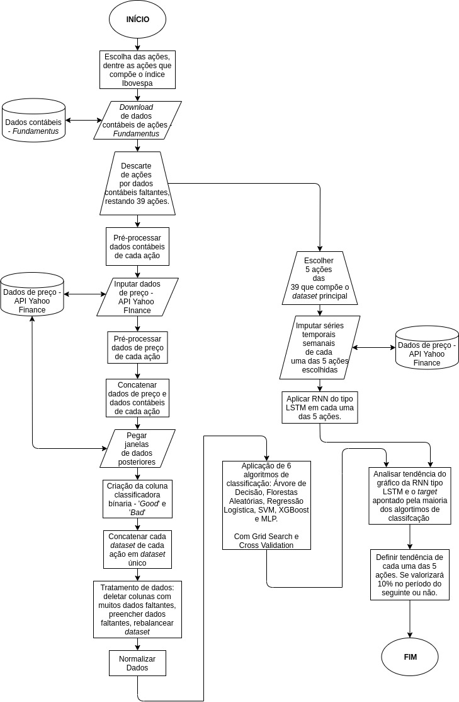

  

# Jarbas Carriconde
*Projeto de Graduação em Engenharia de Automação pela Univerisdade Federal do Rio Grande - FURG*

# 1. Contextualização

O presente trabalho procura abordar o desenvolvimento de algoritmos que se apropriam de inteligência artificial para identificar tendências de mercado em ações e  auxiliar o investidor que mira retornos no longo prazo, finalidade esta pouco abordada em trabalhos acadêmicos que envolvam tecnologia para predições no mercado financeiro.

O trabalho visava  buscar ações que retornem 10% ou mais em um período de no mínimo um ano. Ainda que investidores não fossem capazes de predizer a porcentagem do crescimento do preço de uma determinada ação ao longo do tempo, tal informação é vital para investidores que buscam rendimentos no longo prazo. Relação esta que foge dos tradicionais HFT's que são negociações que acontecem em alta velocidade, em questão de segundos onde investidores buscam pequenos retornos encontrando pequenas disparidades de preços. Ou até mesmo dos chamados day trade e swing trade, onde o primeiro são negociações realizadas concretizadas em um mesmo dia e o segundo são negociações que levam entre um e alguns dias entre as realizações de compra e venda.

Há uma série de vantagens para investidores que optam por buscar retornos no longo 
prazo, logo se torna uma nuance com muito espaço para ser explorado. Como principais beneficio tem-se a redução com custos transacionais como corretagens(valor pago para emitir ordem de compra/venda de uma ação), os impostos sobre os ganhos são proporcionalmente menores, há uma melhor capacidade de adaptar o portfólio de ativos de acordo com as mudanças econômicas sem sofrer com questões tributárias, é capaz de tolerar as volatilidades de curto prazo obtendo maiores lucros no longo prazo além de capitalizar a volatilidade inerente que se relaciona com o risco, ou seja, quanto maior o risco maior os possíveis retornos.

A lógica se dará por criar uma atributo que compara o preço atual da ação em relação ao preço de exatamente um ano antes, assim obtendo uma classificação da ação como ‘Boa’ ou ‘Ruim’, e é essa variável classificatória que deverá ser predita por algoritmos de aprendizado de máquina para averiguar se uma ação é classificada como ‘Boa’, que segundo o algoritmo significaria que é tida como uma ação recomendada para se investir e com potencial de valorização no próximo ano corrente. 

A outra parte da metodologia teve seu embasamento que mostra a aplicação de redes neurais recorrentes do tipo LSTM na previsão de tendências de preços de ações com base em preços históricos.

Portanto, o presente trabalho busca pegar uma parte da metodologia que constrói um dataset com dados de preço e dados contábeis das empresas, e aplica algoritmos de classificação para inferir um target como ‘Bom’ caso a ação se valorize em 10% ou mais no período de um ano, e ‘Ruim’ caso o contrário. Com isso, juntamente incorporar aplicação de algoritmos mais sofisticados, bem como utilizar  técnicas de ajustes de hiperparâmetros e métodos para avaliar a capacidade de generalização dos modelos, além de um robusto pré-processamento dos dados. A outra parte da metodologia trazida em parte de nelson2017uso busca a aplicação de uma LSTM sobre séries temporais de ações com base em dados de preços anteriores no intuito de buscar a visualização gráfica de tendências do preço. 

Ao final, une-se os algoritmos de aprendizado de máquina que buscam a classificação binária que indica se uma ação irá se valorizar em 10% ou não no próximo ano, e aliado a isso busca-se uma inferência por parte da LSTM para através de aplicação sobre séries temporais visualizar a tendência, e assim utilizando os dois segmentos busca-se o auxílio para tomada de decisão em investimentos de longo prazo mirando uma convergência entre os algoritmos de classificação e a tendência apontada pelo gráfico oritundo da LSTM. Sendo feitos, ao final, análises e considerações no que tange o desempenho auferido com base nos recursos e metodologias utilizados no presente trabalho.

# 2. Sequência de Etapas

- Escolher ações dentre as que compõe o índice Ibovespa.

- Fazer download dos dados contábeis das ações.

- Descartar ações com muitos dados contábeis faltantes.

- Pré-processar dados contábeis de cada ação.

- Extrair dados de preço das ações.

- Concatenar dados de preço e contábil de cada ação. Criar \textit{target} que diz se a ação se valorizorá 10\% ou não no próximo 1 ano.

- Concatenar todos os dados das ações em dataset único.

- Tratar dados e normalizar os dados.

- Aplicação de 6 algoritmos de aprendizado de máquina classificatórios.

- Escolher 5 ações dentre as selecionadas.

- Extrair séries temporais de preço de cada uma das 5 ações.

- Aplicar RNN do tipo LSTM em cada uma das 5 ações.

- Validar todos os algoritmos aplicados no trabalho com dados de teste.

- Executar processo de inferência, através  da tendência do gráfico apontado pelos dados preditos pela LSTM em conjunto com o os \textit{targets} mostrados pelos modelos dos algoritmos de classificação. Utilizando dados futuros para uma tentativa real de predição, sem possibilidade de utilização de dados de teste.

- Concluir e avaliar o desempenho dos resultados obtidos na fase de teste e, principalmente, nas inferências,   considerando recursos possíveis e metodologia utilizados.

# 3. Fluxograma das Etapas

  

# 4. Etapas

Aqui irei descrever cada etapa e colocar os respectivos links para as pastas e notebooks correspondentes, que estarão com seus códigos devidamente explicados.

## 4.1 Escolha das Ações

Como critério de seleção de ações para compor o dados do dataset principal do presente trabalho, foi definido que seria de maior relevância a utilização de ações que compõem o principal índice de ações no mercado de capitais brasileiro, o índice Ibovespa. Com base na carteira téorica do dia 22/10/2019, as 69 ações que compunham o índice conforme o site da [BMF&Bovespa](http://www.bmfbovespa.com.br/pt_br/produtos/indices/indices-amplos/indice-ibovespa-ibovespa-composicao-da-carteira.htm).

Após a definição do critério para escolha das ações, necessitava-se averiguar a disponibilidade dos dados contábeis que iriam compor o dataset final, e como fonte aberta e gratuita de dados contábeis, foi utilizado o site da [Fundamentus](https://www.fundamentus.com.br/), onde basta realizar uma pesquisa na página inicial através do código da ação ou nome da empresa que estarão disponíveis umas série de dados contábeis a respeito da maioria das empresas de capital aberto na BMF\&Bovespa em formato excel.

Os dados contábeis estão dispostos em uma escala temporal trimestral que é o período em que os balanços das empresas são divulgados, e observou-se um padrão em que a maioria das empresas possui dados de até 10 anos antes do último balanço divulgado. No momento em que o presente trabalho estava sendo desenvolvido o padrão era de dados do segundo trimestre de 2019 até o segundo trimestre de 2009, portanto definiu-se como critérios para selecionar a ação para ter seus dados junto ao dataset, no mínimo dados com maior robustez e com um histórico disponível de no mínimo 5 anos antes, ou seja, no mínimo até o segundo trimestre de 2014. Além de que, dados contábeis de ações onde bancos eram as empresas emissoras foram descartadas por estarem dispostas em um padrão diferente em relação a todas as empresas restantes. 

Após análise do conjunto de dados de balanço de cada uma das 69 ações que compunham o índice Ibovespa, foram descartadas todas as ações de empresas bancárias e ações nas quais seu arquivo excel apresentava pouco histórico de trimestres ou muitos dados faltantes, assim restaram 39 ações onde cada um dos arquivos de balanço contábil deve passar por um pré-processamento para ser concatenado em formato CSV com dados de preço.

  

Os dados de preço são extraídos da API Yahoo Finance, onde através de código em python são definidas as delimitações das datas de início e fim dos dados a serem extraídos, além da escala temporal que os dados estarão colocados. No presente trabalho foi definida a extração dos dados na escala mensal de forma que a delimitação das datas estivessem criteriosamente de acordo com a delimitação temporal dos dados contábeis, procedimento este sendo feito individualmente para cada uma das 39 ações, uma vez que nem todos os dados contábeis atendiam ao padrão da maioria que dispunham de dados contábeis de até 10 anos antes do último balanço divulgado.

  

### 4.1.1 Pastas com notebooks das 39 Ações

Aqui temos uma pasta para cada uma das ações selecionadas, conforme critério estabelecido anteriormente. Onde em cada pasta temos todos os códigos em notebook devidamente comentado e explicado, bem como o csv de dados fundamentalistas de cada respectiva empresa. E além disso, o csv resultande.

Lembrando que cada código trata os dados fundamentalistas, de preço, bem como a criação do target. Tudo devidamente explicado.
